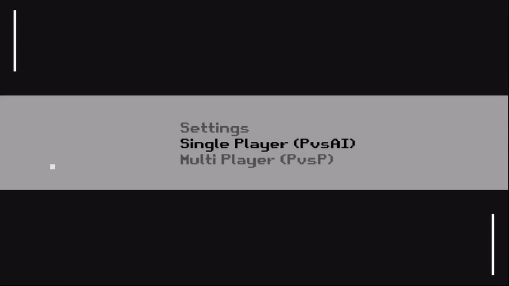

# Pong

A clone of the popular 8-bit game, Pong! The first stepping stone
of every game developer. There are a few bugs w.r.t collisions, 
but most of it should work fine.

Demo of my game:



## Steps to Play!

For Linux and Mac users, please install [Love2D](https://love2d.org/) from the official site or your distribution's package manager, then follow the [clone section](#steps-to-clone-and-run)

For Windows users, you can find the zipped executable files in the **Releases** section **[here](https://github.com/RikilG-GD/01_Pong/releases)**

## Steps to Clone and Run

Windows users, please make sure that you have Love2D installation in `PATH` to run from source files

1. Clone the repository by running `git clone https://github.com/RikilG-GD/01_Pong.git`
2. Enter the source directory `cd 01_Pong/src`
3. Run the game with `love .`

## Directory Structure

```sh
01_Pong/src
├── assets # all game assets are here
│   ├── fonts # fonts stored here
│   └── sounds # game sound files
├── AiPaddle.lua
├── Ball.lua
├── Menu.lua
├── Paddle.lua
├── PauseMenu.lua
├── class.lua # helpful class library
└── main.lua # starting point of game
```

## Credits and Acknowledgements

Firstly, the most important parts of the game: Sound Effects!

- [PrettyLobster](https://opengameart.org/users/prettylobster) for the excellent [background music](https://opengameart.org/content/srstrnc-by-prettylobster) (from opengameart)
- Win and Death 8-bit sound effects from [here](https://opengameart.org/content/oldschool-win-and-die-jump-and-run-sounds) (from opengameart)
- PaddleHit, WallHit, MenuSelect and PowerUp sounds created with [jfxr](https://jfxr.frozenfractal.com/#)

For the Idea and game structure

- [GD50](https://www.edx.org/course/cs50s-introduction-to-game-development) course on edx

For the basic introduction to lua and code snippets

- GD50's pong implementation on [github](https://github.com/games50/pong/)
- Lua class helper file from [here](https://github.com/vrld/hump/blob/master/class.lua)
